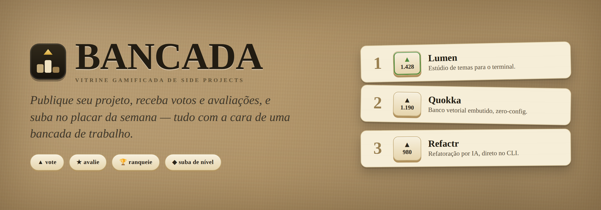

# Bancada



**Bancada** é uma vitrine gamificada de side projects: um placar semanal com
pódio, votos e XP para a comunidade de builders. A interface segue uma metáfora
física de "bancada de trabalho" — madeira texturizada, papel, carimbos
editoriais e botões que afundam ao clicar.

Projeto criado com [Next.js](https://nextjs.org) (App Router, TypeScript,
Tailwind CSS v4), iniciado via `create-next-app`.

Próximos passos de gamificação estão em [`ROADMAP.md`](ROADMAP.md).

## Telas

| Rota | Tela | Descrição |
| --- | --- | --- |
| `/` | **Placar (1b)** | Tela principal: abas **Top / Novos / Em alta**, **busca** e **filtro por categoria**, pódio (top 3), lista ranqueada (com média de estrelas), conta e ação de publicar. |
| `/project/[slug]` | **Detalhe (1d)** | Hero, estatísticas, ações físicas (votar/abrir), descrição, tags e reviews da comunidade. |
| `/dev/[handle]` | **Perfil (1e)** | Nível, barra de XP, conquistas e projetos publicados do dev. |
| `/entrar`, `/cadastrar` | **Conta** | Login e cadastro (handle + senha). |
| `/publicar`, `/project/[slug]/editar` | **Formulários** | Publicar (requer login) e editar (só o dono). |
| `/perfil/editar` | **Perfil** | Editar o próprio nome, bio e avatar. |
| `/meus-projetos` | **Meus projetos** | Gerenciar (ver/editar/excluir) os projetos que você publicou. |
| `/hall-da-fama` | **Hall da Fama** | Disputa da semana atual (top 3 + quanto falta) e os vencedores de semanas passadas. |
| `/notificacoes` | **Notificações** | Feed de eventos dos seus projetos (votos e avaliações recebidos), com selo de não-lidas no header. |

A tela principal é a **1b** (placar de ranking); as telas internas seguem a
direção visual da 1b, conforme o protótipo de referência.

## Contas e persistência

- Dados em **SQLite** (`better-sqlite3`), arquivo local em `data/bancada.db`,
  semeado a partir do seed na primeira execução.
- **Autenticação própria**: cadastro/login com senha (hash `scrypt` nativo) e
  sessão por cookie `httpOnly`. Opcionalmente, **login com GitHub** (OAuth).
- **Publicar** exige login; o autor vem da conta. **Editar/excluir** só o dono.
- **Voto persistente e por usuário**: no máximo um voto por projeto por conta.
- **Reviews reais**: avaliações (1–5 estrelas + texto) da comunidade, uma por
  usuário por projeto; não é possível avaliar o próprio projeto.
- **Perfil editável** (nome/bio/avatar); o perfil é calculado dos votos recebidos.
- **Notificações**: quando alguém vota ou avalia um projeto seu, o dono recebe
  um aviso (feed em `/notificacoes` + selo de não-lidas no sino do header). Só a
  primeira avaliação de cada pessoa gera aviso; editar uma avaliação não repete.
- **Ciclo semanal**: o placar da semana conta os votos da semana corrente
  (segunda 00:00 UTC → segunda seguinte). Ao virar a semana, o 1º lugar é coroado
  e arquivado no **Hall da Fama** — sem agendador: as semanas concluídas são
  "encerradas" de forma preguiçosa na leitura. Uma faixa no topo do placar mostra
  o líder da semana e quanto falta para encerrar.
- **Variação de posição** (`▲/▼`): cada projeto mostra como se moveu na disputa
  desta semana vs. a semana passada (`▲2` subiu, `▼1` caiu, `novo` entrou), no
  placar (pódio e lista) e no Hall da Fama.
- **Ordenação do placar** em abas: `top` (mais votados), `novos` (recentes) e
  `alta` (mais votos nos últimos 7 dias) — via `?ordem=`.
- **Busca** (`?q=` em nome/resumo/autor) e **filtro por categoria** (`?cat=`);
  a **média de estrelas** aparece nos cards do placar.
- **Screenshot** do projeto e **avatar** do usuário guardados no banco e
  **otimizados no upload** com `sharp` (redimensiona e reencoda em WebP).
- API CRUD sob `/api/projects` (+ `/vote`, `/image`, `/reviews`),
  `/api/profile` e `/api/auth/{register,login,logout}`.

## Rodando localmente

```bash
npm install
npm run dev
# abra http://localhost:3000
```

Outros comandos:

```bash
npm run build   # build de produção
npm run start   # serve o build de produção
npm run lint    # ESLint
npm test        # testes unitários (Jest)
```

### Login com GitHub (opcional)

O botão "Entrar com GitHub" só aparece se as variáveis abaixo estiverem
definidas (ex.: em `.env.local`):

```bash
GITHUB_CLIENT_ID=seu_client_id
GITHUB_CLIENT_SECRET=seu_client_secret
# opcional; por padrão usa <origin>/api/auth/github/callback
GITHUB_REDIRECT_URI=http://localhost:3000/api/auth/github/callback
```

Crie um **OAuth App** em GitHub → Settings → Developer settings, com o
"Authorization callback URL" igual ao `GITHUB_REDIRECT_URI`. No primeiro login,
a conta é criada com o handle do GitHub e o avatar é importado.

Quem entra com GitHub pode **importar um repositório público** direto na tela de
publicar: o formulário é pré-preenchido com nome, descrição, tags, estrelas e a
URL do projeto. (Opcional: defina `GITHUB_TOKEN` para elevar o limite de taxa da
listagem de repositórios.)

## Estrutura

```
src/
  app/
    page.tsx                 # 1b — placar (tela principal)
    project/[slug]/page.tsx  # 1d — detalhe do projeto
    dev/[handle]/page.tsx    # 1e — perfil do dev
    layout.tsx               # fontes (Archivo, JetBrains Mono, Newsreader) + metadata
    globals.css              # tokens e estilos base
    api/                     # rotas de API (projetos, voto, auth)
  components/                # Board, Logo, PodiumCard, RankRow, VoteButton, AuthForm, etc.
  lib/
    data.ts                  # tipos, seed e perfis estáticos
    db.ts                    # conexão SQLite, schema e seed
    projects.ts              # repositório de projetos (CRUD, voto, rank)
    auth.ts                  # usuários, sessões e senha (scrypt)
```
